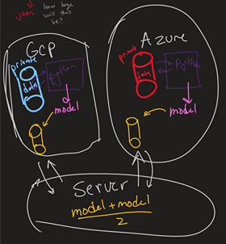
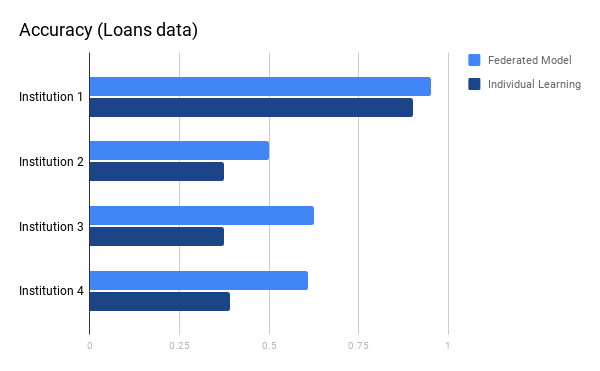

## Federated Learning as a service - Train ML models without *data* [Devpost](https://devpost.com/software/federated-learning-as-a-service)
### *Top finalist at DubHacks 2020*

## YouTube Video (click image below)

#### 

## Inspiration
As somewhat experienced in Machine Learning, one of the challenges I frequently ran into was availability of data. More specifically, access to data to train my models. At a time where [data doubles every 2 years](https://www.reuters.com/video/watch/id22044143), access to training ML models with reliable datasets should only increase, and not stay constant!

However, there are real reasons as to why a lot of data isn't being open-sourced to the public. For one, a lot of individual/consumer data is restricted by data preserving rules such as GDPR, California Privacy Law, COPA, and also various forms of health industry privacy laws such as HIPPA. This makes access to these datasets very difficult and often infeasible for individuals without licenses (e.g. students). 
This is where our approach to help fix this HUGE problem comes into play.

## What it does
Assume an organization has their data stored in one of two major cloud providers (GCP or Microsoft Azure). Based on pre-agreed conditions by these organizations, the companies share the trained models of their data (based on another agreed upon Machine Learning model) to a parent node. This parent node has access to encrypted versions of individually trained weights of each file (using differential privacy via Ornstein-Uhlenbeck noise process) and runs an algorithm known as federated averaging (which we built) to convert individual weight files into one *meaningful* weight file and send this back to all of its children/client nodes. This process is repeated several time (10-100) until the model starts to converge.

Using this process, we can TRAIN any Machine Learning/Deep Learning model without having all the data in one concentric place. We've proven (check our video) that using this technique, we outperform traditional techniques by nearly 2x!

## How we built it
PyTorch, GCP, Microsoft Azure, Cloud-Storage, Blob-Storage, a lot of cloud stuff!!!

## Proof: Federated Learning works!!!

